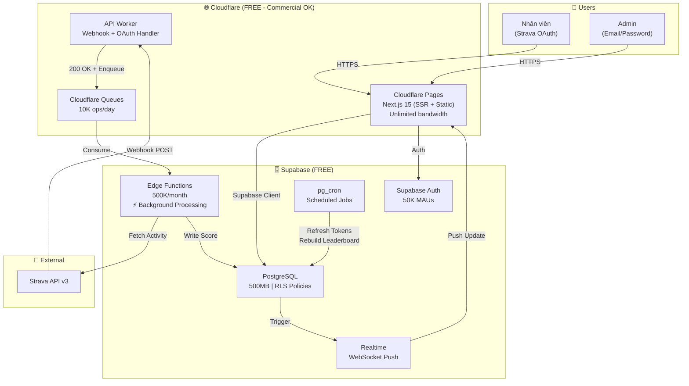
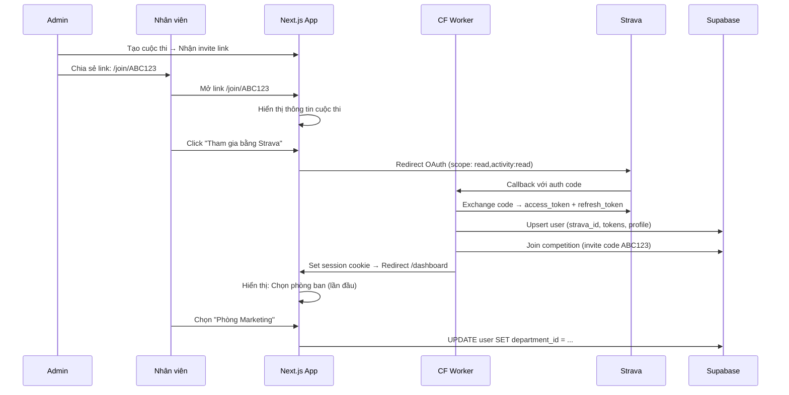
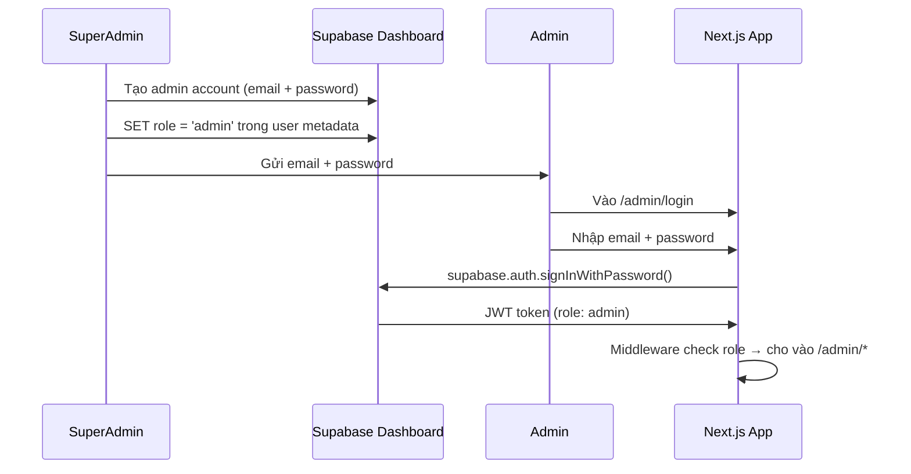
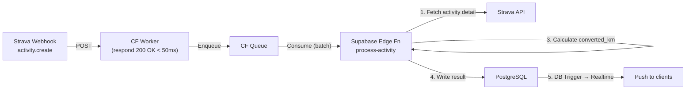
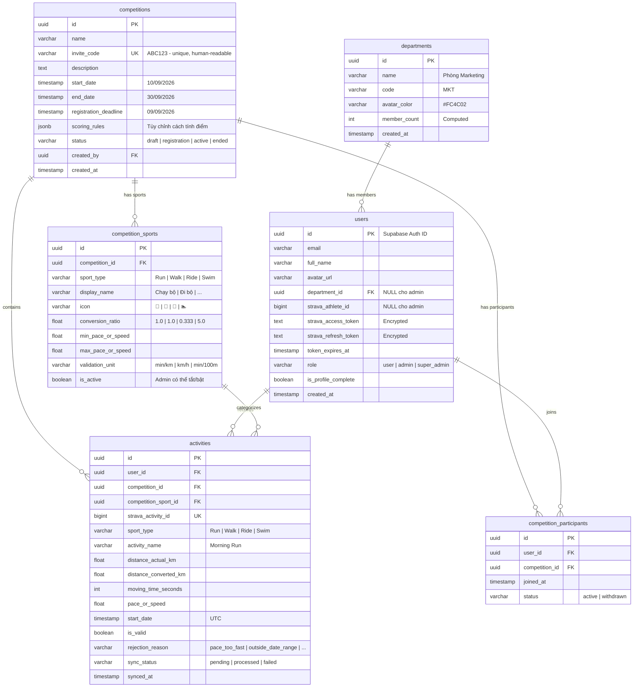

# 🏆 Strava Ranking App — Final Deployment Plan v2

> **Cập nhật:** Dự án công ty → Cloudflare Workers (free commercial) + Supabase  
> **Mục tiêu:** $0/tháng, 500 users, background tasks, UI premium, responsive

---

## 1. Tổng quan kiến trúc

### Tại sao Cloudflare + Supabase?

| Yêu cầu | Giải pháp | Lý do |
|:---|:---|:---|
| Dự án **công ty** (commercial) | ❌ Vercel Hobby (cấm commercial) | Cloudflare Workers **free cho commercial** ✅ |
| **Background tasks** | Supabase Edge Functions + CF Queues | Event-driven, không cần server 24/7 |
| **500 users** đồng thời | CF Edge (0ms cold start) + Supabase | Auto-scale, zero ops |
| **$0/tháng** | Cả 2 free tier dư sức | Xem [phần 7](#7-free-tier-budget) |

### Architecture Diagram



---

## 2. Hai luồng Auth riêng biệt

### 2A. User Flow: Strava OAuth + Invite Link



**Invite Link Format:**
```
https://strava-ranking.pages.dev/join/ABC123
         ↑ domain tự động từ CF Pages
```

- `ABC123` = mã cuộc thi (unique, human-readable)
- Link hiển thị: Tên cuộc thi, thời gian, các bộ môn, số người đã tham gia
- Chưa đăng nhập → redirect sang Strava OAuth → auto-join sau khi auth

### 2B. Admin Flow: Email/Password (Tạo sẵn)



**Phân quyền:**

| Role | Truy cập | Tạo bởi |
|:---|:---|:---|
| `user` | Dashboard, Leaderboard, Profile | Tự đăng ký qua Strava |
| `admin` | Tất cả + Admin Dashboard | SuperAdmin tạo trong Supabase |
| `super_admin` | Tất cả + Quản lý admin khác | Seed data ban đầu |

> [!NOTE]
> Admin **không cần** tài khoản Strava. Họ chỉ quản lý hệ thống, không tham gia thi đấu.

---

## 3. Background Tasks Strategy

> [!IMPORTANT]
> Đây là điểm quan trọng bạn quan tâm. Hệ thống có **3 loại background task**, tất cả đều serverless và FREE.

### Task 1: Xử lý Strava Webhook (Event-driven)



**Tại sao cần Queue?**
- Strava yêu cầu respond **< 2 giây** → CF Worker respond ngay, đẩy vào queue
- Queue batching: Nếu nhiều webhooks đến cùng lúc → xử lý theo batch, tránh rate limit Strava API (100 req/15min)
- Retry tự động nếu Edge Function fail

### Task 2: Refresh Strava Tokens (Scheduled - pg_cron)

```sql
-- Chạy mỗi 30 phút, refresh tokens sắp hết hạn trong 1 giờ tới
SELECT cron.schedule(
    'refresh-strava-tokens',
    '*/30 * * * *',
    $$
    SELECT net.http_post(
        url := 'https://<project>.supabase.co/functions/v1/refresh-tokens',
        headers := '{"Authorization": "Bearer <service_role_key>"}'::jsonb,
        body := '{}'::jsonb
    );
    $$
);
```

- **pg_cron** chạy bên trong PostgreSQL → không cần Celery Beat
- Edge Function `refresh-tokens` xử lý batch refresh
- Chỉ refresh tokens **hết hạn trong 1 giờ tới** → tối ưu API calls

### Task 3: Rebuild Leaderboard Cache (Scheduled - pg_cron)

```sql
-- Refresh materialized view mỗi 60 giây
SELECT cron.schedule(
    'refresh-leaderboard',
    '* * * * *',
    'REFRESH MATERIALIZED VIEW CONCURRENTLY mv_leaderboard_individual;
     REFRESH MATERIALIZED VIEW CONCURRENTLY mv_leaderboard_department;'
);
```

- **Materialized View** = "pre-computed leaderboard" trong PostgreSQL
- `CONCURRENTLY` = refresh không block reads → users luôn thấy data
- Leaderboard query = **< 5ms** (đọc từ view, không JOIN)
- Thay thế hoàn toàn Redis cache

### Tổng hợp Background Tasks

| Task | Trigger | Xử lý bởi | Tần suất |
|:---|:---|:---|:---|
| Process Activity | Strava Webhook | CF Queue → Supabase Edge Fn | Event-driven |
| Refresh Tokens | Scheduled | pg_cron → Supabase Edge Fn | Mỗi 30 phút |
| Rebuild Leaderboard | Scheduled | pg_cron (SQL thuần) | Mỗi 60 giây |
| Sync Historical Data | Manual (admin) | Supabase Edge Fn | On-demand |

---

## 4. Database Schema



### Row Level Security (RLS) Policies

```sql
-- Users: ai cũng đọc được profile công khai
CREATE POLICY "Public profiles" ON users
    FOR SELECT USING (true);

-- Users: chỉ sửa được profile của mình
CREATE POLICY "Own profile" ON users
    FOR UPDATE USING (auth.uid() = id);

-- Activities: ai cũng đọc được (leaderboard công khai)
CREATE POLICY "Public activities" ON activities
    FOR SELECT USING (true);

-- Activities: chỉ hệ thống ghi (service_role)
CREATE POLICY "System write" ON activities
    FOR INSERT WITH CHECK (auth.role() = 'service_role');

-- Admin: full access
CREATE POLICY "Admin full access" ON competitions
    FOR ALL USING (
        EXISTS (
            SELECT 1 FROM users
            WHERE users.id = auth.uid()
            AND users.role IN ('admin', 'super_admin')
        )
    );
```

---

## 5. UI/UX Design System — Light & Dark Mode

### Color Tokens (CSS Custom Properties)

```css
/* ===== LIGHT MODE (Default) ===== */
:root {
    /* Brand - Strava Orange */
    --brand-500: #FC4C02;
    --brand-600: #E04400;
    --brand-gradient: linear-gradient(135deg, #FC4C02, #FF6B35);
    --brand-glow: rgba(252, 76, 2, 0.12);

    /* Backgrounds */
    --bg-primary: #FFFFFF;
    --bg-secondary: #F8F9FC;
    --bg-tertiary: #F0F2F7;
    --bg-card: #FFFFFF;
    --bg-card-hover: #F8F9FC;
    --bg-glass: rgba(255, 255, 255, 0.8);

    /* Text */
    --text-primary: #1A1A2E;
    --text-secondary: #6B7280;
    --text-tertiary: #9CA3AF;
    --text-inverse: #FFFFFF;

    /* Borders & Dividers */
    --border-primary: #E5E7EB;
    --border-secondary: #F0F2F7;

    /* Sport Colors */
    --sport-run: #10B981;
    --sport-run-bg: rgba(16, 185, 129, 0.08);
    --sport-ride: #3B82F6;
    --sport-ride-bg: rgba(59, 130, 246, 0.08);
    --sport-swim: #8B5CF6;
    --sport-swim-bg: rgba(139, 92, 246, 0.08);
    --sport-walk: #F59E0B;
    --sport-walk-bg: rgba(245, 158, 11, 0.08);

    /* Rank Colors */
    --rank-gold: #F59E0B;
    --rank-silver: #9CA3AF;
    --rank-bronze: #CD7F32;

    /* Status */
    --success: #10B981;
    --warning: #F59E0B;
    --danger: #EF4444;
    --info: #3B82F6;

    /* Elevation */
    --shadow-sm: 0 1px 3px rgba(0, 0, 0, 0.06);
    --shadow-md: 0 4px 16px rgba(0, 0, 0, 0.08);
    --shadow-lg: 0 8px 32px rgba(0, 0, 0, 0.1);
    --shadow-glow: 0 0 40px var(--brand-glow);

    /* Glass */
    --glass-bg: rgba(255, 255, 255, 0.7);
    --glass-border: rgba(0, 0, 0, 0.06);
    --glass-blur: blur(20px);

    /* Typography */
    --font-heading: 'Outfit', sans-serif;
    --font-body: 'Inter', sans-serif;
    --font-mono: 'JetBrains Mono', monospace;

    /* Spacing Scale */
    --space-1: 0.25rem;
    --space-2: 0.5rem;
    --space-3: 0.75rem;
    --space-4: 1rem;
    --space-6: 1.5rem;
    --space-8: 2rem;
    --space-12: 3rem;
    --space-16: 4rem;

    /* Border Radius */
    --radius-sm: 0.5rem;
    --radius-md: 0.75rem;
    --radius-lg: 1rem;
    --radius-xl: 1.5rem;
    --radius-full: 9999px;

    /* Transitions */
    --transition-fast: 150ms cubic-bezier(0.4, 0, 0.2, 1);
    --transition-base: 250ms cubic-bezier(0.4, 0, 0.2, 1);
    --transition-slow: 400ms cubic-bezier(0.4, 0, 0.2, 1);
}

/* ===== DARK MODE ===== */
@media (prefers-color-scheme: dark) {
    :root {
        --bg-primary: #0B0B12;
        --bg-secondary: #12121C;
        --bg-tertiary: #1A1A28;
        --bg-card: #16162280;
        --bg-card-hover: #1E1E30;
        --bg-glass: rgba(22, 22, 34, 0.8);

        --text-primary: #F0F0F8;
        --text-secondary: #8B8BA0;
        --text-tertiary: #5A5A70;

        --border-primary: rgba(255, 255, 255, 0.08);
        --border-secondary: rgba(255, 255, 255, 0.04);

        --brand-glow: rgba(252, 76, 2, 0.2);

        --shadow-sm: 0 1px 3px rgba(0, 0, 0, 0.3);
        --shadow-md: 0 4px 16px rgba(0, 0, 0, 0.4);
        --shadow-lg: 0 8px 32px rgba(0, 0, 0, 0.5);

        --glass-bg: rgba(22, 22, 34, 0.7);
        --glass-border: rgba(255, 255, 255, 0.06);
    }
}

/* Manual toggle override */
[data-theme="dark"] {
    /* Same dark values as above */
}

[data-theme="light"] {
    /* Same light values as above (default) */
}
```

### Các trang & UI Components

| Trang | Ai xem | Đặc điểm UI |
|:---|:---|:---|
| **`/join/:code`** | Mọi người (public) | Hero card cuộc thi, CTA "Tham gia bằng Strava", countdown timer |
| **`/leaderboard`** | Mọi người (public) | 🏅 Podium top 3 (animated), table xếp hạng, filter tabs (All / Run / Ride / Swim / Walk), toggle Cá nhân / Phòng ban |
| **`/dashboard`** | Users (auth) | Stats cards (tổng km, rank, activities), activity timeline, progress chart, sport breakdown donut |
| **`/profile`** | Users (auth) | Avatar, thông tin, phòng ban, Strava connection status, cuộc thi đang tham gia |
| **`/`** | Public | Landing page: Hero, features, live leaderboard preview, CTA |
| **`/admin`** | Admin only | Sidebar nav, data tables, forms, charts |
| **`/admin/competitions`** | Admin | Tạo/sửa cuộc thi, generate invite link, thêm/bớt bộ môn |
| **`/admin/users`** | Admin | Danh sách users, assign phòng ban, xem activities |
| **`/admin/activities`** | Admin | Đối soát activities, approve/reject, filter nghi vấn |
| **`/admin/reports`** | Admin | Xuất báo cáo CSV/Excel, thống kê tổng kết |

### Leaderboard UI Concept

```
┌─────────────────────────────────────────────────────┐
│  🏆 Bảng Xếp Hạng          [Cá nhân ▾] [Tất cả ▾] │
│                              ↑ toggle    ↑ filter   │
│        🥈          🥇          🥉                    │
│     ┌──────┐   ┌──────┐   ┌──────┐                 │
│     │Avatar│   │Avatar│   │Avatar│                  │
│     │Tên   │   │Tên   │   │Tên   │                  │
│     │42 km │   │68 km │   │38 km │                  │
│     └──────┘   └──────┘   └──────┘                  │
│         2          1           3        ← Podium    │
│─────────────────────────────────────────────────────│
│  # │ 👤 Tên        │ Phòng ban  │ 🏃  │ 🚴  │ Tổng │
│  4 │ Nguyễn Văn A  │ Marketing  │ 12  │ 8   │ 35   │
│  5 │ Trần Thị B    │ IT         │ 28  │ 0   │ 32   │
│  6 │ Lê Văn C      │ Sales      │ 5   │ 15  │ 30   │
│  ...                                                │
└─────────────────────────────────────────────────────┘
```

---

## 6. Project Structure

```
strava-ranking/
├── docs/                              # Tài liệu hiện có (giữ nguyên)
│
├── src/                               # Next.js 15 App
│   ├── app/
│   │   ├── (public)/                  # Public routes
│   │   │   ├── page.tsx               # Landing page
│   │   │   ├── leaderboard/
│   │   │   │   └── page.tsx           # Bảng xếp hạng (public)
│   │   │   ├── join/
│   │   │   │   └── [code]/
│   │   │   │       └── page.tsx       # Invite link page
│   │   │   └── rules/
│   │   │       └── page.tsx           # Quy định cuộc thi
│   │   │
│   │   ├── (auth)/                    # Protected routes (users)
│   │   │   ├── layout.tsx             # Auth check middleware
│   │   │   ├── dashboard/
│   │   │   │   └── page.tsx           # Personal dashboard
│   │   │   ├── profile/
│   │   │   │   └── page.tsx           # Profile & settings
│   │   │   └── competitions/
│   │   │       └── page.tsx           # My competitions
│   │   │
│   │   ├── (admin)/                   # Admin routes
│   │   │   ├── layout.tsx             # Admin role check
│   │   │   └── admin/
│   │   │       ├── page.tsx           # Admin overview
│   │   │       ├── login/
│   │   │       │   └── page.tsx       # Admin email/pass login
│   │   │       ├── competitions/
│   │   │       │   ├── page.tsx       # List competitions
│   │   │       │   ├── new/
│   │   │       │   │   └── page.tsx   # Create competition
│   │   │       │   └── [id]/
│   │   │       │       └── page.tsx   # Edit competition
│   │   │       ├── departments/
│   │   │       │   └── page.tsx       # Manage departments
│   │   │       ├── users/
│   │   │       │   └── page.tsx       # Manage users
│   │   │       ├── activities/
│   │   │       │   └── page.tsx       # Verify activities
│   │   │       └── reports/
│   │   │           └── page.tsx       # Export reports
│   │   │
│   │   ├── api/                       # API Routes (CF Worker)
│   │   │   ├── auth/
│   │   │   │   └── strava/
│   │   │   │       ├── route.ts       # Initiate Strava OAuth
│   │   │   │       └── callback/
│   │   │   │           └── route.ts   # OAuth callback handler
│   │   │   └── webhook/
│   │   │       └── strava/
│   │   │           └── route.ts       # Webhook receiver → Queue
│   │   │
│   │   ├── layout.tsx                 # Root layout
│   │   ├── globals.css                # Design system tokens
│   │   └── not-found.tsx
│   │
│   ├── components/
│   │   ├── ui/                        # Base: Button, Card, Input, Modal, Table, Badge
│   │   ├── layout/                    # Header, Footer, Sidebar, ThemeToggle
│   │   ├── leaderboard/              # Podium, RankTable, SportFilter, TypeToggle
│   │   ├── dashboard/                # StatsCard, ActivityTimeline, ProgressChart
│   │   ├── competition/              # CompetitionCard, JoinForm, InviteLink
│   │   └── admin/                    # DataTable, ActivityReview, ExportButton
│   │
│   ├── lib/
│   │   ├── supabase/
│   │   │   ├── client.ts             # Browser Supabase client
│   │   │   ├── server.ts             # Server Component client
│   │   │   ├── admin.ts              # Service role client
│   │   │   └── types.ts              # Generated DB types
│   │   ├── strava/
│   │   │   ├── oauth.ts              # OAuth flow helpers
│   │   │   ├── api.ts                # Strava API wrapper
│   │   │   └── scoring.ts            # Pace validation + km conversion
│   │   ├── utils/
│   │   │   ├── format.ts             # Number, date, distance formatters
│   │   │   └── export.ts             # CSV/Excel export
│   │   └── hooks/
│   │       ├── useLeaderboard.ts     # Real-time leaderboard subscription
│   │       ├── useTheme.ts           # Light/Dark mode toggle
│   │       └── useAuth.ts            # Auth state hook
│   │
│   └── types/
│       ├── database.ts               # Supabase generated types
│       ├── strava.ts                  # Strava API types
│       └── index.ts
│
├── supabase/
│   ├── config.toml                    # Supabase project config
│   ├── migrations/
│   │   ├── 001_initial_schema.sql     # Tables + indexes
│   │   ├── 002_rls_policies.sql       # Row Level Security
│   │   ├── 003_materialized_views.sql # Leaderboard views
│   │   ├── 004_pg_cron_jobs.sql       # Scheduled tasks
│   │   └── 005_functions.sql          # PostgreSQL functions
│   ├── functions/
│   │   ├── process-activity/
│   │   │   └── index.ts               # Process webhook event
│   │   └── refresh-tokens/
│   │       └── index.ts               # Batch refresh Strava tokens
│   └── seed.sql                       # Admin account + sample data
│
├── public/
│   ├── icons/                         # Sport icons, favicon
│   └── og-image.png                   # Social sharing image
│
├── wrangler.jsonc                     # Cloudflare Workers config
├── open-next.config.ts                # @opennextjs/cloudflare config
├── next.config.ts
├── package.json
├── tsconfig.json
└── .github/
    └── workflows/
        └── deploy.yml                 # CI/CD: CF Pages + Supabase
```

---

## 7. Free Tier Budget

### Cloudflare (Commercial OK ✅)

| Resource | Free Limit | Dự kiến sử dụng | Status |
|:---|:---|:---|:---|
| Pages Bandwidth | **Unlimited** | ~5 GB/mo | ✅ Unlimited |
| Workers Requests | 100K/day | ~3K/day (500 users) | ✅ 97% dư |
| Workers CPU | 10ms/invocation | ~2ms (webhook ack) | ✅ 80% dư |
| Queues Operations | 10K/day | ~500/day (webhook events) | ✅ 95% dư |
| D1 / KV | Có nhưng không dùng | 0 | ✅ N/A |

### Supabase (Commercial OK ✅)

| Resource | Free Limit | Dự kiến sử dụng | Status |
|:---|:---|:---|:---|
| Database Storage | 500 MB | ~10 MB | ✅ 98% dư |
| Auth MAUs | 50,000 | 500 | ✅ 99% dư |
| Edge Function Invocations | 500K/mo | ~15K/mo | ✅ 97% dư |
| Bandwidth | 5 GB/mo | ~1 GB/mo | ✅ 80% dư |
| Realtime Connections | Shared tier | ~50 concurrent | ✅ OK |

### Tổng chi phí

| Hạng mục | Chi phí |
|:---|:---|
| Cloudflare Pages + Workers | **$0** |
| Supabase (DB + Auth + Edge Fn) | **$0** |
| Domain (tùy chọn) | $0 (dùng `*.pages.dev`) hoặc ~$10/năm |
| **TỔNG** | **$0/tháng** 🎉 |

---

## 8. Execution Plan

### Phase 1: Foundation (Ngày 1-3)

```
📦 Setup & Infrastructure
├── Init Next.js 15 + TypeScript project
├── Setup @opennextjs/cloudflare
├── Setup Supabase project (free tier)
├── Database migrations (all tables + indexes + RLS)
├── Materialized views + pg_cron jobs
├── Design System CSS (globals.css - cả light & dark mode)
├── Base UI components (Button, Card, Input, Modal, Badge, Table)
├── Layout components (Header, Footer, Sidebar, ThemeToggle)
└── Supabase Auth integration (signIn, signOut, session)
```

### Phase 2: Auth & Strava Integration (Ngày 4-5)

```
🔐 Authentication & Data Pipeline
├── Strava OAuth 2.0 flow (authorize → callback → token exchange)
├── Admin email/password login
├── Middleware: route protection (user / admin roles)
├── Strava Webhook receiver (API Route → CF Queue)
├── Supabase Edge Function: process-activity
│   ├── Fetch activity from Strava API
│   ├── Validate pace/speed (per sport rules)
│   ├── Calculate converted_km
│   └── Write to DB
├── Supabase Edge Function: refresh-tokens
├── Invite link system (/join/:code)
└── First-login flow: choose department
```

### Phase 3: Core Pages (Ngày 6-9)

```
🎨 User-Facing Features
├── Landing Page (/)
│   ├── Hero with animated gradient
│   ├── Features section
│   ├── Live leaderboard preview
│   └── CTA → join link
├── Leaderboard (/leaderboard)
│   ├── Podium top 3 (animated, responsive)
│   ├── Ranking table (sortable, paginated)
│   ├── Filter: Tất cả | Chạy | Đạp xe | Bơi | Đi bộ
│   ├── Toggle: Cá nhân ↔ Phòng ban
│   ├── Real-time updates (Supabase Realtime)
│   └── Responsive (mobile cards / desktop table)
├── Dashboard (/dashboard)
│   ├── Stats cards (rank, total km, activities count)
│   ├── Activity timeline (recent activities)
│   ├── Sport breakdown (donut chart)
│   ├── Progress over time (line chart)
│   └── Competition status
├── Profile (/profile)
│   ├── User info + avatar
│   ├── Department selection
│   ├── Strava connection status
│   └── Competition participation list
└── Join Competition (/join/:code)
    ├── Competition details card
    ├── Countdown to start/end
    ├── Sport list with rules
    ├── Participant count
    └── CTA: "Tham gia bằng Strava"
```

### Phase 4: Admin Dashboard (Ngày 10-12)

```
⚙️ Admin Features
├── Admin Login (/admin/login)
├── Admin Overview (/admin)
│   ├── Total users, activities, departments
│   └── Quick stats charts
├── Competition Management (/admin/competitions)
│   ├── Create/Edit competition
│   ├── Add/remove sports + rules
│   ├── Generate & copy invite link
│   └── Start/End competition
├── Department Management (/admin/departments)
│   ├── CRUD departments
│   └── View members per department
├── User Management (/admin/users)
│   ├── View all users
│   ├── Assign/change department
│   └── View user activities
├── Activity Verification (/admin/activities)
│   ├── Flag suspicious activities
│   ├── Approve/Reject with reason
│   └── Bulk actions
└── Reports (/admin/reports)
    ├── Summary statistics
    ├── Export CSV/Excel
    └── Print-ready report
```

### Phase 5: Polish & Deploy (Ngày 13-14)

```
🚀 Final Polish
├── Micro-animations (Framer Motion)
│   ├── Page transitions
│   ├── Leaderboard rank changes
│   ├── Counter animations
│   └── Loading skeletons
├── Responsive testing (mobile, tablet, desktop)
├── Performance optimization
│   ├── Image optimization
│   ├── Code splitting
│   └── Caching headers
├── Deploy to Cloudflare Pages (production)
├── Deploy Supabase Edge Functions
├── Register Strava Webhook subscription
├── Seed admin account + test data
├── Security checklist
│   ├── RLS policies verified
│   ├── Strava tokens encrypted
│   ├── CORS configured
│   └── Rate limiting
└── Load test simulation (500 concurrent)
```

> **Tổng thời gian: ~14 ngày làm việc**

---

## 9. Risks & Mitigations

| # | Rủi ro | Mức độ | Giải pháp |
|:---|:---|:---|:---|
| 1 | Supabase free project pause sau 1 tuần inactive | Thấp | Cuộc thi active liên tục 20 ngày; thêm cron ping phòng hờ |
| 2 | Strava API rate limit (100 req/15min per app) | Trung bình | Queue batching + exponential backoff trong Edge Function |
| 3 | CF Workers 10ms CPU limit cho SSR phức tạp | Thấp | SSR pages đơn giản, heavy logic chuyển sang Supabase Edge Fn |
| 4 | Strava yêu cầu dev subscription (từ 06/2026) | Cần kiểm tra | Verify Strava developer account trước khi bắt đầu |
| 5 | @opennextjs/cloudflare có thể có quirks | Thấp | Đã GA 1.0, fallback: deploy SPA thuần nếu cần |

> [!WARNING]
> **Quan trọng:** Cần kiểm tra Strava Developer Program hiện tại có yêu cầu subscription không (thay đổi từ 06/2026). Nếu có, cần đăng ký trước khi bắt đầu develop.

---

## 10. Tóm tắt quyết định kỹ thuật

| Quyết định | Lựa chọn | Thay thế đã xem xét |
|:---|:---|:---|
| **Hosting Frontend** | Cloudflare Pages + Workers | Vercel (❌ non-commercial) |
| **Framework** | Next.js 15 (@opennextjs/cloudflare) | Vite React SPA |
| **Database** | Supabase PostgreSQL | Cloudflare D1 (SQLite, limited) |
| **Auth (Users)** | Strava OAuth 2.0 | - |
| **Auth (Admin)** | Supabase email/password | - |
| **Background Tasks** | CF Queues + Supabase Edge Fn | Celery (❌ cần server 24/7) |
| **Scheduled Jobs** | pg_cron (trong PostgreSQL) | Celery Beat (❌ cần server) |
| **Leaderboard Cache** | Materialized Views | Redis (❌ tốn tiền cho 500 users) |
| **Realtime Updates** | Supabase Realtime (WebSocket) | Polling (❌ wasteful) |
| **Styling** | Vanilla CSS + Custom Properties | Tailwind (not requested) |
| **Theme** | Light + Dark (system pref + toggle) | - |
| **Animations** | Framer Motion | CSS Animations only |
