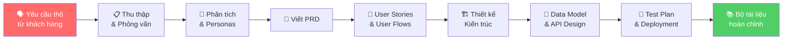
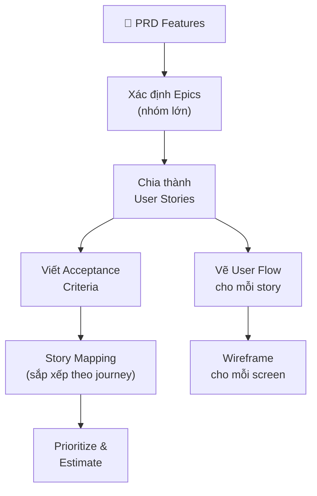
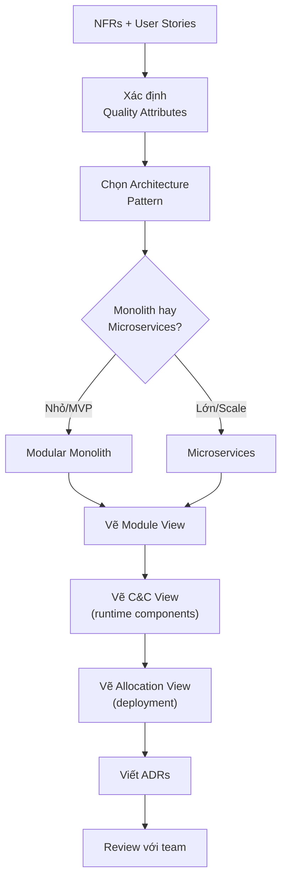
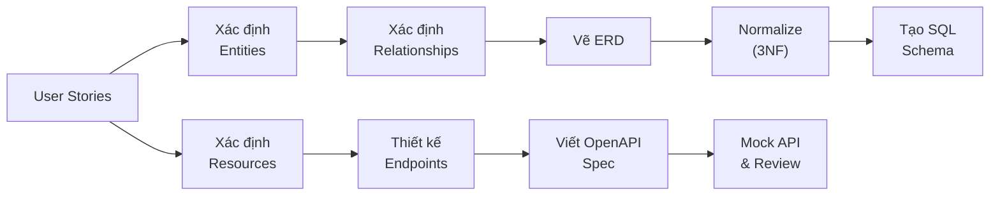

# 🎓 Lộ Trình Học: Từ Yêu Cầu Khách Hàng → Xây Dựng Toàn Bộ Tài Liệu Dự Án

> [!NOTE]
> Tài liệu này hướng dẫn bạn **từng bước** cách chuyển đổi yêu cầu thô từ khách hàng thành một bộ tài liệu dự án phần mềm hoàn chỉnh, chuyên nghiệp.

---

## 🗺️ Tổng Quan Quy Trình



---

## Bước 1: 🗣️ Thu Thập Yêu Cầu (Requirement Gathering)

### Bạn cần làm gì?
Gặp khách hàng, lắng nghe, đặt câu hỏi, và ghi chép lại **mọi thứ** họ nói.

### Input → Output
```
INPUT:  Cuộc họp / email / brief từ khách hàng
OUTPUT: ✅ Meeting Minutes (biên bản họp)
        ✅ Raw Requirements List (danh sách yêu cầu thô)
        ✅ Stakeholder Map (bản đồ các bên liên quan)
```

### Kỹ năng cần học

| Kỹ năng | Mô tả | Mức độ |
|---------|--------|--------|
| **Active Listening** | Lắng nghe chủ động, không giả định | ⭐ Quan trọng nhất |
| **Questioning Techniques** | 5W1H, Open-ended vs Closed questions | ⭐⭐⭐ |
| **Domain Analysis** | Hiểu lĩnh vực kinh doanh của khách hàng | ⭐⭐⭐ |
| **Note-taking** | Ghi chép có cấu trúc | ⭐⭐ |

### Các kỹ thuật thu thập yêu cầu

| Kỹ thuật | Khi nào dùng | Cách thực hiện |
|----------|-------------|----------------|
| **Interview** | Luôn luôn - bước đầu tiên | Phỏng vấn 1-1 hoặc nhóm stakeholders |
| **Workshop** | Dự án lớn, nhiều stakeholders | Tổ chức buổi workshop có facilitator |
| **Observation** | Cải thiện hệ thống hiện tại | Quan sát người dùng làm việc thực tế |
| **Questionnaire** | Nhiều người dùng, ít thời gian | Gửi survey có cấu trúc |
| **Document Analysis** | Có hệ thống cũ | Phân tích tài liệu/quy trình hiện tại |
| **Prototyping** | Yêu cầu mơ hồ | Làm prototype nhanh để validate |

### Checklist câu hỏi khi gặp khách hàng
```
🎯 VỀ MỤC TIÊU:
□ Vấn đề chính bạn đang gặp phải là gì?
□ Bạn mong muốn đạt được gì với phần mềm này?
□ Thế nào là "thành công" đối với dự án này?
□ KPIs nào bạn muốn cải thiện?

👥 VỀ NGƯỜI DÙNG:
□ Ai sẽ sử dụng hệ thống? (roles)
□ Mỗi ngày họ làm công việc gì?
□ Họ hiện tại dùng công cụ gì?
□ Có bao nhiêu người dùng dự kiến?

⚙️ VỀ CHỨC NĂNG:
□ Liệt kê các tính năng bạn PHẢI có?
□ Tính năng nào là "nice to have"?
□ Có quy trình nghiệp vụ nào cần tự động hóa?
□ Cần tích hợp với hệ thống nào khác?

🚫 VỀ RÀNG BUỘC:
□ Deadline / timeline?
□ Budget?
□ Yêu cầu về công nghệ?
□ Compliance / quy định pháp lý?
□ Yêu cầu bảo mật?

📊 VỀ DỮ LIỆU:
□ Dữ liệu hiện tại lưu ở đâu? Format gì?
□ Cần migrate dữ liệu cũ không?
□ Báo cáo nào cần xuất ra?
```

### 📚 Tài nguyên học tập

| Loại | Tên | Link/Ghi chú |
|------|-----|---------------|
| 📖 Sách | **"Software Requirements" - Karl Wiegers** | Sách kinh điển về requirements engineering |
| 📖 Sách | **"User Story Mapping" - Jeff Patton** | Kỹ thuật map yêu cầu thành stories |
| 🎥 YouTube | **"Requirements Gathering Techniques"** | Search: "BA requirements gathering tutorial" |
| 🎓 Khóa học | **Coursera: Software Requirements Prioritization** | Coursera / Udemy |
| 📝 Template | **Meeting Minutes Template** | Confluence / Notion templates |

### 🛠️ Công cụ
- **Ghi chép:** Notion, OneNote, Google Docs
- **Ghi âm (nếu được phép):** Otter.ai, Google Recorder
- **Mind Map:** Miro, XMind, MindMeister

---

## Bước 2: 🧠 Phân Tích & Xây Dựng User Personas

### Input → Output
```
INPUT:  Raw Requirements List, Meeting Minutes
OUTPUT: ✅ Stakeholder Analysis
        ✅ User Personas
        ✅ Problem Statement
        ✅ Vision & Scope Document
```

### Kỹ năng cần học

| Kỹ năng | Mô tả |
|---------|--------|
| **Stakeholder Analysis** | Xác định ai có ảnh hưởng, ai cần gì |
| **User Persona Creation** | Tạo hồ sơ đại diện cho nhóm người dùng |
| **Problem Framing** | Định nghĩa vấn đề rõ ràng |
| **MoSCoW Prioritization** | Phân loại Must/Should/Could/Won't |

### Ví dụ User Persona

```
┌──────────────────────────────────────────────┐
│  👤 PERSONA: Nguyễn Văn Minh                 │
│  Role: Quản lý kho hàng                      │
│  Tuổi: 35 | Kinh nghiệm: 8 năm              │
├──────────────────────────────────────────────┤
│  🎯 Mục tiêu:                                │
│  - Theo dõi tồn kho real-time                │
│  - Giảm thời gian kiểm kê hàng tháng        │
│  - Cảnh báo khi hàng sắp hết                │
├──────────────────────────────────────────────┤
│  😤 Pain Points:                              │
│  - Đang dùng Excel, hay bị lỗi              │
│  - Mất 2 ngày để kiểm kê mỗi tháng         │
│  - Không biết hàng tồn kho chính xác        │
├──────────────────────────────────────────────┤
│  💻 Tech Savviness: Trung bình               │
│  Thiết bị: PC (chính), Điện thoại (phụ)     │
└──────────────────────────────────────────────┘
```

### Ví dụ MoSCoW Prioritization

| Priority | Feature | Lý do |
|----------|---------|-------|
| **Must** | Quản lý nhập/xuất kho | Core business |
| **Must** | Báo cáo tồn kho | Yêu cầu bắt buộc |
| **Should** | Cảnh báo hết hàng | Quan trọng nhưng không blocking |
| **Could** | Quét barcode | Nice to have, tăng trải nghiệm |
| **Won't** | AI dự đoán nhu cầu | Phase 2, ngoài scope hiện tại |

### 📚 Tài nguyên học tập

| Loại | Tên |
|------|-----|
| 📖 Sách | **"Lean UX" - Jeff Gothelf** |
| 📖 Sách | **"Inspired" - Marty Cagan** (Product Management bible) |
| 🎥 Video | YouTube: "How to Create User Personas" |
| 🔧 Tool | Miro Persona Template, UXPressia |
| 📝 Template | Lean Canvas, Business Model Canvas |

---

## Bước 3: 📄 Viết PRD (Product Requirements Document)

### Input → Output
```
INPUT:  Personas, Stakeholder Analysis, Prioritized Requirements
OUTPUT: ✅ PRD hoàn chỉnh
        ✅ BRD (nếu cần cho enterprise)
```

### Cấu trúc PRD chi tiết

```
📄 PRD - [Tên Sản Phẩm]
│
├── 1. Executive Summary
│   └── Tóm tắt 1-2 đoạn về sản phẩm
│
├── 2. Problem Statement
│   ├── Vấn đề hiện tại
│   ├── Impact (ảnh hưởng)
│   └── Cơ hội
│
├── 3. Goals & Success Metrics
│   ├── Business Goals
│   ├── User Goals
│   └── KPIs / OKRs
│       Ví dụ: "Giảm 50% thời gian kiểm kê"
│
├── 4. Target Users
│   └── Link tới User Personas
│
├── 5. Scope
│   ├── In Scope (làm gì)
│   └── Out of Scope (KHÔNG làm gì) ← RẤT QUAN TRỌNG
│
├── 6. Feature Requirements
│   ├── Feature 1: [Tên]
│   │   ├── Description
│   │   ├── User Stories
│   │   ├── Acceptance Criteria
│   │   ├── Wireframe/Mockup
│   │   └── Priority (MoSCoW)
│   ├── Feature 2: [Tên]
│   └── ...
│
├── 7. Non-Functional Requirements
│   ├── Performance (response time < 2s)
│   ├── Security (encryption, auth)
│   ├── Scalability (1000 concurrent users)
│   └── Availability (99.9% uptime)
│
├── 8. Technical Considerations
│   └── Constraints, integrations, tech preferences
│
├── 9. Timeline & Milestones
│   ├── Phase 1: MVP (Week 1-8)
│   ├── Phase 2: Enhancement (Week 9-12)
│   └── Phase 3: Scale (Week 13+)
│
├── 10. Risks & Mitigations
│
└── 11. Appendix
    ├── Glossary
    ├── References
    └── Change Log
```

> [!TIP]
> **Mẹo viết PRD tốt:**
> - Viết cho **người đọc không có technical background** cũng hiểu được
> - Luôn có phần **"Out of Scope"** — giúp tránh scope creep
> - Mỗi feature phải có **acceptance criteria** rõ ràng
> - Dùng wireframe/mockup kèm theo — "một hình ảnh bằng ngàn lời nói"

### 📚 Tài nguyên học tập

| Loại | Tên |
|------|-----|
| 📖 Sách | **"Inspired" - Marty Cagan** |
| 📖 Sách | **"Escaping the Build Trap" - Melissa Perri** |
| 🎥 Video | YouTube: "How to Write a PRD" - Product School |
| 📝 Template | PRD Template by Atlassian / Notion / Coda |
| 🎓 Khóa học | **Product Management Certificate** - Product School |
| 📝 Tham khảo | Các PRD mẫu trên Medium / Product Hunt |

---

## Bước 4: 📝 Viết User Stories & User Flows

### Input → Output
```
INPUT:  PRD, User Personas
OUTPUT: ✅ Epics & User Stories (với Acceptance Criteria)
        ✅ User Flow Diagrams
        ✅ Use Case Specifications
        ✅ Wireframes / Mockups
```

### Kỹ năng cần học

| Kỹ năng | Chi tiết |
|---------|----------|
| **User Story Writing** | Format: As a... I want... So that... |
| **Story Mapping** | Kỹ thuật Jeff Patton — sắp xếp stories theo user journey |
| **User Flow Design** | Vẽ luồng từ screen → screen |
| **Wireframing** | Vẽ layout UI cơ bản |
| **BDD - Given/When/Then** | Viết acceptance criteria chuẩn |

### Quy trình từ PRD → User Stories



### Ví dụ: Từ Feature → Epic → User Stories

```
📄 PRD Feature: "Quản lý nhập kho"
    │
    ├── 🏔️ EPIC: Nhập kho
    │   │
    │   ├── 📝 US-101: Tạo phiếu nhập kho
    │   │   As a warehouse staff,
    │   │   I want to create a new import receipt,
    │   │   So that I can record incoming goods.
    │   │
    │   │   Acceptance Criteria:
    │   │   ✓ Given I am on import page
    │   │     When I fill in supplier, items, quantities
    │   │     Then a new import receipt is created with status "Draft"
    │   │
    │   │   ✓ Given the total quantity exceeds warehouse capacity
    │   │     When I try to submit
    │   │     Then I see warning "Warehouse capacity exceeded"
    │   │
    │   ├── 📝 US-102: Duyệt phiếu nhập kho
    │   │   As a warehouse manager,
    │   │   I want to approve/reject import receipts,
    │   │   So that only verified goods are recorded.
    │   │
    │   ├── 📝 US-103: In phiếu nhập kho
    │   │
    │   └── 📝 US-104: Tìm kiếm phiếu nhập kho
    │
    └── 🏔️ EPIC: Báo cáo nhập kho
        ├── 📝 US-201: Xem báo cáo nhập kho theo ngày
        └── 📝 US-202: Xuất báo cáo Excel
```

### 📚 Tài nguyên học tập

| Loại | Tên |
|------|-----|
| 📖 Sách | **"User Story Mapping" - Jeff Patton** ⭐ Rất hay |
| 📖 Sách | **"Writing Effective User Stories" - Thomas & Angela Hathaway** |
| 🎥 Video | YouTube: "User Story Mapping in 6 minutes" |
| 🔧 Tool | Figma (wireframe), draw.io (user flow), Miro (story mapping) |
| 🎓 Khóa học | Udemy: "Agile User Stories" |
| 📝 Template | Jira / Azure DevOps user story templates |

---

## Bước 5: 🏗️ Thiết Kế Kiến Trúc (Architecture Design)

### Input → Output
```
INPUT:  PRD, User Stories, Non-Functional Requirements
OUTPUT: ✅ System Context Diagram (C4 Level 1)
        ✅ Container Diagram (C4 Level 2)
        ✅ Module View
        ✅ Component & Connector (C&C) View
        ✅ Allocation View (Deployment Diagram)
        ✅ ADRs (Architecture Decision Records)
        ✅ Technology Stack Document
```

### Kỹ năng cần học

| Kỹ năng | Chi tiết |
|---------|----------|
| **C4 Model** | 4 mức: Context → Container → Component → Code |
| **Architecture Patterns** | Monolith, Microservices, Event-driven, CQRS |
| **Design Patterns** | GoF patterns, Repository, SOLID principles |
| **Cloud Architecture** | AWS/GCP/Azure services & best practices |
| **Quality Attributes** | Performance, Scalability, Security trade-offs |
| **Diagramming** | UML, C4, ArchiMate notation |

### Quy trình thiết kế kiến trúc



### Cách chọn Architecture Pattern

| Yêu cầu | Pattern phù hợp |
|----------|-----------------|
| MVP / dự án nhỏ / 1-3 dev | **Modular Monolith** |
| Cần scale từng phần riêng biệt | **Microservices** |
| Real-time, high throughput | **Event-driven** |
| Read/Write tải khác nhau nhiều | **CQRS** |
| Serverless, pay-per-use | **Serverless (Lambda/Functions)** |

### Từ NFR → Architecture Decision

```
NFR: "Hệ thống phải xử lý 10,000 concurrent users"
    │
    ├── → Decision: Dùng load balancer + horizontal scaling
    ├── → Decision: Stateless services (session in Redis)
    ├── → Decision: Database read replicas
    │
    └── 📝 ADR-003: Horizontal Scaling Strategy
        Status: Accepted
        Context: Yêu cầu 10K concurrent users...
        Decision: Dùng K8s auto-scaling + Redis session store
        Consequences: + Scale linh hoạt  - Phức tạp hơn deploy
```

### 📚 Tài nguyên học tập

| Loại | Tên |
|------|-----|
| 📖 Sách | **"Software Architecture in Practice" - Bass, Clements, Kazman** ⭐ |
| 📖 Sách | **"Fundamentals of Software Architecture" - Mark Richards & Neal Ford** ⭐ |
| 📖 Sách | **"Designing Data-Intensive Applications" - Martin Kleppmann** |
| 📖 Sách | **"Clean Architecture" - Robert C. Martin** |
| 🌐 Web | **c4model.com** — Hướng dẫn C4 Model chính thức |
| 🌐 Web | **adr.github.io** — ADR templates & examples |
| 🎥 Video | YouTube: "Software Architecture Monday" - Mark Richards |
| 🎓 Khóa học | Udemy: "Software Architecture & Design" |
| 🔧 Tool | **draw.io, Structurizr** (C4), **PlantUML**, **Mermaid** |

> [!IMPORTANT]
> **Module View, C&C View, Allocation View** là 3 views cốt lõi theo phương pháp **"Views and Beyond"** của SEI/CMU. Hãy đọc sách **"Documenting Software Architectures: Views and Beyond"** để hiểu sâu.

---

## Bước 6: 💾 Thiết Kế Data Model & API

### Input → Output
```
INPUT:  Module View, C&C View, User Stories
OUTPUT: ✅ ERD (Entity Relationship Diagram)
        ✅ Database Schema
        ✅ API Specification (OpenAPI/Swagger)
        ✅ API Authentication & Authorization Design
```

### Kỹ năng cần học

| Kỹ năng | Chi tiết |
|---------|----------|
| **Database Design** | Normalization (1NF → 3NF), denormalization |
| **ER Modeling** | Entities, Relationships, Cardinality |
| **RESTful API Design** | Resources, HTTP methods, status codes, versioning |
| **API Security** | OAuth2, JWT, API keys |
| **Schema Design** | SQL (relational) vs NoSQL (document/key-value) |

### Quy trình



### 📚 Tài nguyên học tập

| Loại | Tên |
|------|-----|
| 📖 Sách | **"Database Design for Mere Mortals" - Michael Hernandez** |
| 📖 Sách | **"RESTful Web APIs" - Leonard Richardson** |
| 🌐 Web | **swagger.io/docs** — OpenAPI Specification |
| 🌐 Web | **restfulapi.net** — REST API best practices |
| 🔧 Tool | **dbdiagram.io** (ERD), **Swagger Editor**, **Postman** |
| 🎥 Video | YouTube: "Database Design Tutorial" - freeCodeCamp |

---

## Bước 7: 🧪 Viết Test Plan & Deployment Docs

### Input → Output
```
INPUT:  User Stories (Acceptance Criteria), Architecture Docs
OUTPUT: ✅ Test Plan
        ✅ Test Cases
        ✅ Deployment Guide
        ✅ CI/CD Pipeline Documentation
        ✅ Runbook
```

### Test Case từ Acceptance Criteria

```
User Story: US-101 - Tạo phiếu nhập kho
Acceptance Criteria:
  Given I fill in all required fields
  When  I click "Submit"
  Then  receipt is created with status "Draft"

        ↓ Chuyển thành Test Cases ↓

┌─────────────────────────────────────────────┐
│ TC-101-01: Tạo phiếu nhập kho thành công   │
│ Precondition: Đã login với role staff       │
│ Steps:                                       │
│   1. Navigate to /import/new                 │
│   2. Select supplier "ABC Corp"              │
│   3. Add item "Widget A", qty: 100           │
│   4. Click "Submit"                          │
│ Expected: Receipt created, status = "Draft"  │
│ Priority: High                               │
├─────────────────────────────────────────────┤
│ TC-101-02: Tạo phiếu thiếu thông tin       │
│ Steps:                                       │
│   1. Navigate to /import/new                 │
│   2. Leave supplier empty                    │
│   3. Click "Submit"                          │
│ Expected: Validation error displayed         │
├─────────────────────────────────────────────┤
│ TC-101-03: Vượt sức chứa kho               │
│ ...                                          │
└─────────────────────────────────────────────┘
```

### 📚 Tài nguyên học tập

| Loại | Tên |
|------|-----|
| 📖 Sách | **"Lessons Learned in Software Testing" - Kaner, Bach, Pettichord** |
| 📖 Sách | **"The DevOps Handbook" - Gene Kim** |
| 🔧 Tool | **TestRail** (test management), **Docker**, **GitHub Actions** |
| 🎓 Khóa học | ISTQB Foundation Level (chứng chỉ testing quốc tế) |

---

## Bước 8: 📚 Hoàn Thiện & Vận Hành

### Input → Output
```
INPUT:  Toàn bộ tài liệu trên
OUTPUT: ✅ User Guide
        ✅ Release Notes / Changelog
        ✅ Monitoring & Alerting Setup
        ✅ Disaster Recovery Plan
        ✅ FAQ / Knowledge Base
```

---

## 📅 Timeline Học Tập Gợi Ý (12 Tuần)

| Tuần | Chủ đề | Hoạt động |
|------|--------|-----------|
| **1-2** | Requirement Gathering | Đọc sách Wiegers + Thực hành phỏng vấn |
| **3** | User Personas & Analysis | Tạo persona cho dự án giả lập |
| **4-5** | PRD Writing | Viết PRD hoàn chỉnh cho dự án giả lập |
| **6-7** | User Stories & Flows | Story mapping + Vẽ user flow bằng Figma/draw.io |
| **8-9** | Architecture Design | Học C4 Model + Vẽ 3 views (Module, C&C, Allocation) |
| **10** | Data Model & API | Thiết kế ERD + Viết OpenAPI spec |
| **11** | Testing & Deployment | Viết Test Plan + Setup CI/CD cơ bản |
| **12** | Tổng hợp & Review | Hoàn thiện bộ tài liệu + Peer review |

---

## 🏋️ Bài Tập Thực Hành

> [!TIP]
> Cách tốt nhất để học là **làm thực tế**. Hãy chọn 1 trong các đề bài dưới đây và xây dựng toàn bộ tài liệu:

### Đề bài gợi ý (từ dễ → khó):

| # | Đề bài | Độ khó |
|---|--------|--------|
| 1 | **Ứng dụng Todo List** cho team nhỏ | ⭐ |
| 2 | **Hệ thống quản lý thư viện** | ⭐⭐ |
| 3 | **Platform đặt đồ ăn online** | ⭐⭐⭐ |
| 4 | **Hệ thống quản lý kho hàng** cho doanh nghiệp | ⭐⭐⭐⭐ |
| 5 | **Sàn thương mại điện tử** (e-commerce marketplace) | ⭐⭐⭐⭐⭐ |

### Cho mỗi đề bài, hãy tạo:
```
📁 project-docs/
├── 01-business/
│   ├── vision-and-scope.md
│   └── prd.md
├── 02-requirements/
│   ├── user-personas.md
│   ├── user-stories.md
│   ├── user-flows/          ← diagrams
│   └── srs.md
├── 03-architecture/
│   ├── system-context.md     ← C4 Level 1
│   ├── container-diagram.md  ← C4 Level 2
│   ├── module-view.md
│   ├── cc-view.md            ← Component & Connector
│   ├── allocation-view.md    ← Deployment
│   ├── erd.md
│   └── adrs/
│       ├── adr-001-database.md
│       ├── adr-002-auth.md
│       └── adr-003-architecture.md
├── 04-development/
│   ├── api-specification.yaml
│   ├── coding-standards.md
│   └── git-workflow.md
├── 05-testing/
│   ├── test-plan.md
│   └── test-cases.md
├── 06-deployment/
│   ├── deployment-guide.md
│   └── runbook.md
└── 07-user-docs/
    ├── user-guide.md
    └── faq.md
```

---

## 📖 Tổng Hợp Sách Nên Đọc (Theo Thứ Tự Ưu Tiên)

| # | Sách | Tác giả | Về chủ đề |
|---|------|---------|-----------|
| 1 | **Inspired** | Marty Cagan | Product Management, PRD |
| 2 | **User Story Mapping** | Jeff Patton | User Stories, Story Mapping |
| 3 | **Software Requirements** | Karl Wiegers | Requirements Engineering |
| 4 | **Fundamentals of Software Architecture** | Richards & Ford | Architecture toàn diện |
| 5 | **Clean Architecture** | Robert C. Martin | Design principles |
| 6 | **Designing Data-Intensive Applications** | Martin Kleppmann | Data & distributed systems |
| 7 | **The DevOps Handbook** | Gene Kim et al. | CI/CD, Deployment |
| 8 | **Documenting Software Architectures** | Clements et al. | Views & Beyond (Module, C&C, Allocation) |

---

> [!CAUTION]
> **Đừng cố hoàn hảo ngay từ đầu.** Tài liệu dự án là **living documents** — chúng được cập nhật liên tục theo quá trình phát triển. Bắt đầu với bản draft, rồi iterate dần.
