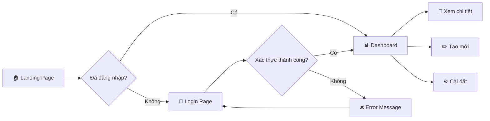
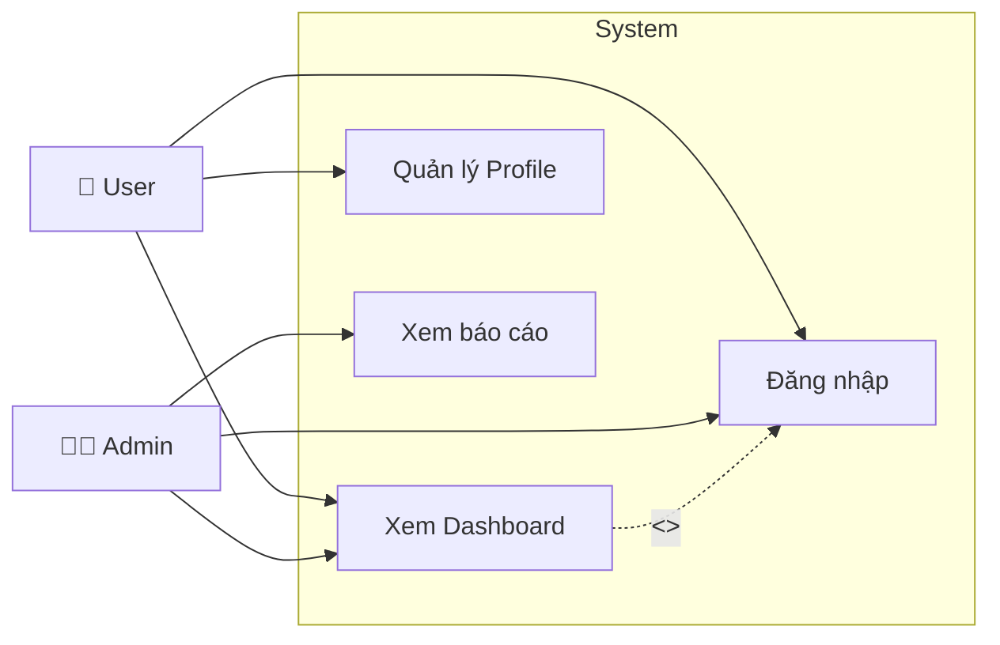
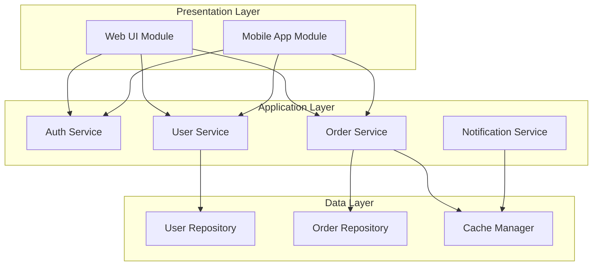
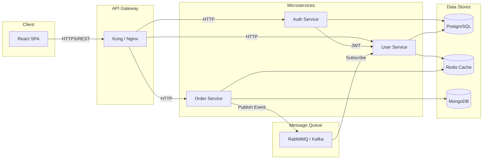
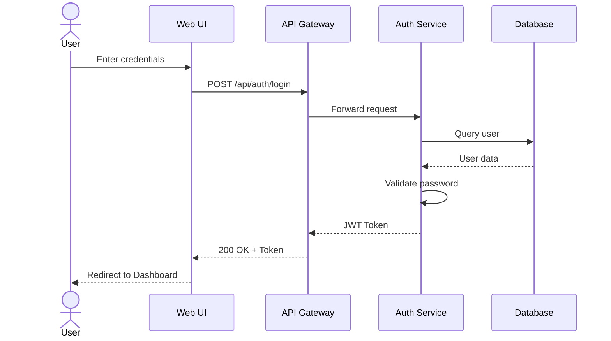
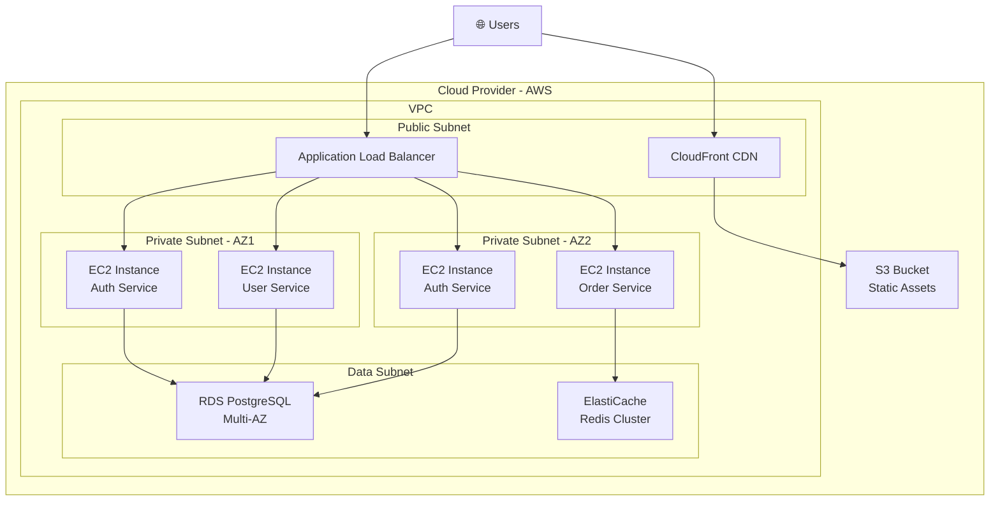
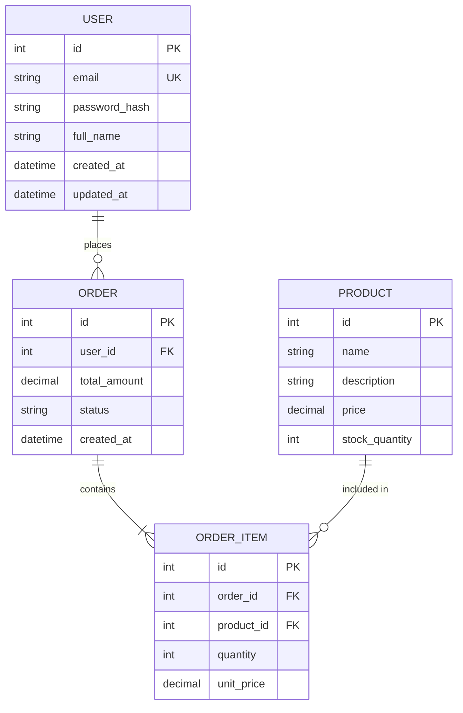

# 📚 Tài Liệu Chuẩn Cho Software Project

> [!NOTE]
> Tài liệu dưới đây tổng hợp **toàn bộ các loại tài liệu** thường có trong một dự án phần mềm chuyên nghiệp, được phân loại theo giai đoạn và mục đích sử dụng.

---

## 🗺️ Tổng Quan Các Loại Tài Liệu

```mermaid
graph TD
    A["📁 Software Project Documentation"] --> B["1. Business & Product"]
    A --> C["2. Requirements"]
    A --> D["3. Architecture & Design"]
    A --> E["4. Development"]
    A --> F["5. Testing & QA"]
    A --> G["6. Deployment & Operations"]
    A --> H["7. User-Facing"]

    B --> B1["Vision & Scope"]
    B --> B2["PRD"]
    B --> B3["Business Requirements"]

    C --> C1["User Stories"]
    C --> C2["User Flow"]
    C --> C3["Use Cases"]
    C --> C4["SRS"]

    D --> D1["Module View"]
    D --> D2["C&C View"]
    D --> D3["Allocation View"]
    D --> D4["ERD / Data Model"]

    E --> E1["API Docs"]
    E --> E2["Code Standards"]
    E --> E3["Git Workflow"]

    F --> F1["Test Plan"]
    F --> F2["Test Cases"]

    G --> G1["Deployment Guide"]
    G --> G2["Runbook"]

    H --> H1["User Guide"]
    H --> H2["FAQ"]
```



---

## 1. 📋 Business & Product Documents

### 1.1 Vision & Scope Document
| Mục | Mô tả |
|-----|--------|
| **Mục đích** | Định nghĩa tầm nhìn, phạm vi dự án |
| **Nội dung** | Business objectives, target users, high-level features, constraints, success metrics |
| **Người viết** | Product Owner / Business Analyst |
| **Thời điểm** | Đầu dự án (Inception phase) |

### 1.2 PRD – Product Requirements Document
| Mục | Mô tả |
|-----|--------|
| **Mục đích** | Mô tả chi tiết sản phẩm cần xây dựng |
| **Nội dung chính** | |

```
PRD thường bao gồm:
├── 1. Overview / Executive Summary
├── 2. Problem Statement
├── 3. Goals & Objectives (OKRs / KPIs)
├── 4. Target Users & Personas
├── 5. User Stories / Use Cases
├── 6. Feature Requirements (functional & non-functional)
├── 7. User Flows & Wireframes
├── 8. Technical Considerations
├── 9. Release Criteria / Definition of Done
├── 10. Timeline & Milestones
├── 11. Risks & Mitigations
└── 12. Appendix (Glossary, References)
```

> [!IMPORTANT]
> PRD là tài liệu **trung tâm** của dự án. Mọi tài liệu khác đều tham chiếu hoặc mở rộng từ PRD.

### 1.3 BRD – Business Requirements Document
- Tập trung vào **nhu cầu kinh doanh** (business needs) hơn là chi tiết sản phẩm
- Trả lời câu hỏi: **"Tại sao cần làm dự án này?"**
- Bao gồm: ROI analysis, cost-benefit, stakeholder analysis

---

## 2. 📝 Requirements Documents

### 2.1 User Stories
```
Format chuẩn:
As a [role], I want [feature], so that [benefit].

Acceptance Criteria (Given-When-Then):
  Given [context]
  When  [action]
  Then  [expected result]
```

**Ví dụ:**
```
US-001: Đăng nhập bằng email
As a registered user,
I want to log in with my email and password,
So that I can access my personal dashboard.

Acceptance Criteria:
  Given I am on the login page
  When  I enter valid email and password and click "Login"
  Then  I am redirected to my dashboard

  Given I am on the login page
  When  I enter invalid credentials
  Then  I see an error message "Invalid email or password"
```

**Phân loại:**
| Loại | Mô tả |
|------|--------|
| **Epic** | Nhóm lớn các User Stories liên quan |
| **User Story** | Một tính năng cụ thể từ góc nhìn người dùng |
| **Task / Sub-task** | Công việc kỹ thuật cụ thể để hoàn thành User Story |

### 2.2 User Flow (Luồng Người Dùng)


**User Flow bao gồm:**
- **Happy path**: Luồng chính, khi mọi thứ hoạt động đúng
- **Alternative paths**: Các luồng thay thế
- **Error paths**: Xử lý khi có lỗi
- **Edge cases**: Các trường hợp đặc biệt

### 2.3 Use Case Diagram & Specification


### 2.4 SRS – Software Requirements Specification (IEEE 830)
```
Cấu trúc SRS chuẩn:
├── 1. Introduction
│   ├── Purpose
│   ├── Scope
│   ├── Definitions & Acronyms
│   └── References
├── 2. Overall Description
│   ├── Product Perspective
│   ├── Product Functions (high-level)
│   ├── User Characteristics
│   ├── Constraints
│   └── Assumptions & Dependencies
├── 3. Specific Requirements
│   ├── Functional Requirements (FR)
│   ├── Non-Functional Requirements (NFR)
│   │   ├── Performance
│   │   ├── Security
│   │   ├── Availability
│   │   ├── Scalability
│   │   └── Usability
│   ├── Interface Requirements
│   │   ├── User Interfaces
│   │   ├── Hardware Interfaces
│   │   ├── Software Interfaces
│   │   └── Communication Interfaces
│   └── Data Requirements
└── 4. Appendices
```

---

## 3. 🏗️ Architecture & Design Documents

> [!TIP]
> Theo mô hình **"4+1" View Model** (Philippe Kruchten) hoặc **Views and Beyond** (SEI/CMU), kiến trúc phần mềm được mô tả qua nhiều "views" khác nhau.

### 3.1 Module View (Logical/Structural View)

**Mục đích:** Mô tả cách hệ thống được **phân chia thành các modules/packages** và quan hệ giữa chúng.



**Nội dung Module View:**
| Thành phần | Mô tả |
|------------|--------|
| **Module Decomposition** | Phân rã hệ thống thành modules |
| **Uses/Depends-on** | Module nào phụ thuộc module nào |
| **Layered View** | Tổ chức theo layers (presentation, business, data) |
| **Class Diagram** | Chi tiết classes trong mỗi module |

### 3.2 Component & Connector View (C&C View / Connection View)

**Mục đích:** Mô tả **runtime behavior** – các components chạy và giao tiếp với nhau như thế nào.



**Nội dung C&C View:**
| Thành phần | Mô tả |
|------------|--------|
| **Components** | Các thành phần runtime (services, processes) |
| **Connectors** | Cách giao tiếp (REST, gRPC, message queue, event bus) |
| **Protocols** | HTTP, WebSocket, AMQP, etc. |
| **Data Flow** | Luồng dữ liệu giữa các components |
| **Sequence Diagrams** | Chi tiết luồng xử lý cho từng use case |

#### Sequence Diagram Ví dụ:


### 3.3 Allocation View (Deployment/Physical View)

**Mục đích:** Mô tả cách **software được map lên hardware/infrastructure**.



**Nội dung Allocation View:**
| Thành phần | Mô tả |
|------------|--------|
| **Deployment Diagram** | Software → Hardware mapping |
| **Network Topology** | Cấu trúc mạng, subnets, security groups |
| **Scaling Strategy** | Auto-scaling rules, load balancing |
| **Resource Specifications** | CPU, RAM, storage cho mỗi node |
| **Work Assignment** | Module → Team mapping |

### 3.4 ERD – Entity Relationship Diagram / Data Model



### 3.5 Các Tài Liệu Design Khác

| Tài liệu | Mô tả |
|-----------|--------|
| **System Context Diagram** (C4 Level 1) | Hệ thống trong bối cảnh với external systems |
| **Container Diagram** (C4 Level 2) | Các applications/services trong hệ thống |
| **Component Diagram** (C4 Level 3) | Chi tiết components trong mỗi container |
| **ADR – Architecture Decision Records** | Ghi lại các quyết định kiến trúc quan trọng và lý do |
| **Technology Stack Document** | Liệt kê và giải thích lý do chọn từng công nghệ |
| **Security Architecture** | Authentication, authorization, encryption, threat model |

#### ADR Template:
```
# ADR-001: Chọn PostgreSQL làm database chính

## Status: Accepted
## Date: 2026-08-03

## Context
Cần chọn RDBMS cho hệ thống có yêu cầu ACID compliance...

## Decision
Sử dụng PostgreSQL 16

## Consequences
+ Hỗ trợ JSON natively
+ Community lớn
- Team cần training
```

---

## 4. 💻 Development Documents

### 4.1 API Documentation
```yaml
# OpenAPI 3.0 Specification (Swagger)
openapi: 3.0.0
info:
  title: User Service API
  version: 1.0.0

paths:
  /api/users:
    get:
      summary: Get all users
      parameters:
        - name: page
          in: query
          schema:
            type: integer
      responses:
        '200':
          description: List of users
    post:
      summary: Create a new user
      requestBody:
        content:
          application/json:
            schema:
              $ref: '#/components/schemas/CreateUserRequest'
      responses:
        '201':
          description: User created
```

### 4.2 Các Tài Liệu Dev Khác

| Tài liệu | Nội dung |
|-----------|----------|
| **Coding Standards / Style Guide** | Conventions, naming, formatting rules |
| **Git Workflow / Branching Strategy** | GitFlow, Trunk-based, PR process |
| **Development Environment Setup** | Hướng dẫn setup local dev environment |
| **CI/CD Pipeline Documentation** | Build, test, deploy pipeline |
| **Database Migration Guide** | Quy trình migration, versioning |
| **Third-party Integration Guide** | Tích hợp với external services |

---

## 5. 🧪 Testing & QA Documents

| Tài liệu | Nội dung |
|-----------|----------|
| **Test Plan** | Phạm vi, chiến lược, resources, schedule testing |
| **Test Cases** | Chi tiết từng test case (ID, steps, expected result) |
| **Test Data** | Dữ liệu test và cách tạo |
| **Performance Test Report** | Load test, stress test results |
| **Security Audit Report** | Penetration testing, vulnerability assessment |
| **UAT Sign-off Document** | User Acceptance Testing checklist & approval |

---

## 6. 🚀 Deployment & Operations Documents

| Tài liệu | Nội dung |
|-----------|----------|
| **Deployment Guide** | Step-by-step deployment procedure |
| **Infrastructure as Code** | Terraform, CloudFormation, Ansible scripts |
| **Runbook / Playbook** | Xử lý sự cố, troubleshooting procedures |
| **Monitoring & Alerting Setup** | Dashboards, alerts, SLAs, SLOs |
| **Disaster Recovery Plan** | Backup, restore, failover procedures |
| **Change Management Process** | Quy trình review & approve thay đổi |

---

## 7. 👥 User-Facing Documents

| Tài liệu | Nội dung |
|-----------|----------|
| **User Guide / Manual** | Hướng dẫn sử dụng chi tiết |
| **FAQ** | Câu hỏi thường gặp |
| **Release Notes / Changelog** | Các thay đổi mỗi version |
| **Onboarding Guide** | Hướng dẫn cho người dùng mới |
| **Knowledge Base** | Tài liệu hỗ trợ self-service |

---

## 📊 Tổng Hợp Theo Giai Đoạn Dự Án

| Giai đoạn | Tài liệu chính |
|-----------|----------------|
| **Inception** | Vision & Scope, BRD, Stakeholder Analysis |
| **Discovery** | PRD, User Personas, User Stories, User Flows |
| **Design** | SRS, Architecture Views (Module, C&C, Allocation), ERD, ADRs, Wireframes/Mockups |
| **Development** | API Docs, Coding Standards, CI/CD Docs, Dev Setup Guide |
| **Testing** | Test Plan, Test Cases, Bug Reports |
| **Deployment** | Deployment Guide, Runbook, Monitoring Setup |
| **Maintenance** | Release Notes, Changelog, Knowledge Base, FAQ |

---

## ⚡ Minimum Viable Documentation (MVP)

> [!TIP]
> Nếu dự án nhỏ hoặc startup, bạn **không cần tất cả**. Dưới đây là bộ tài liệu tối thiểu nhưng đủ chuyên nghiệp:

| # | Tài liệu | Bắt buộc? |
|---|-----------|-----------|
| 1 | **PRD** (gộp Vision + Requirements) | ✅ Bắt buộc |
| 2 | **User Stories** + Acceptance Criteria | ✅ Bắt buộc |
| 3 | **User Flow Diagrams** | ✅ Bắt buộc |
| 4 | **Architecture Overview** (C4 Level 1-2 hoặc Module + C&C View) | ✅ Bắt buộc |
| 5 | **ERD / Data Model** | ✅ Bắt buộc |
| 6 | **API Documentation** (Swagger/OpenAPI) | ✅ Bắt buộc |
| 7 | **Deployment Diagram** (Allocation View) | ⚠️ Nên có |
| 8 | **ADRs** | ⚠️ Nên có |
| 9 | **Test Plan** | ⚠️ Nên có |
| 10 | **README + Setup Guide** | ✅ Bắt buộc |

---

> [!CAUTION]
> Tài liệu chỉ có giá trị khi được **cập nhật thường xuyên**. Tài liệu lỗi thời còn nguy hiểm hơn không có tài liệu, vì nó dẫn đến quyết định sai.
