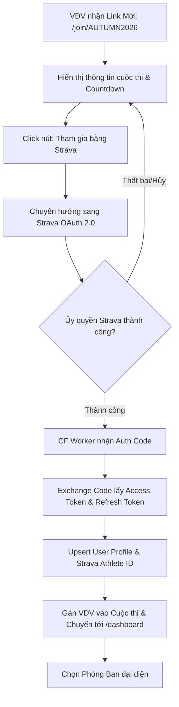
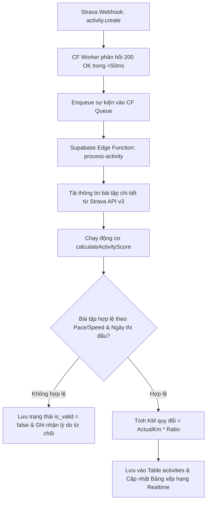
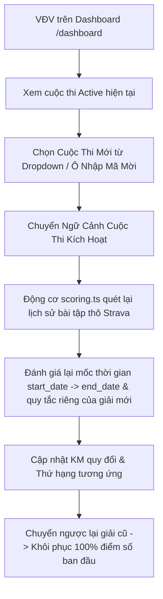
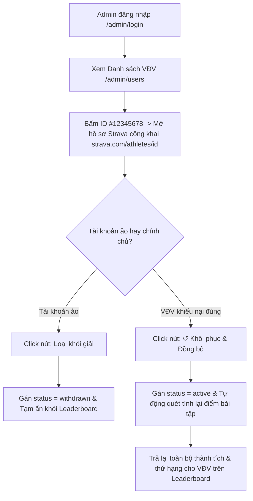

# 🔄 User Flows & Interaction Diagrams — Strava Ranking Platform

> **Tài liệu Luồng Người Dùng & Sơ Đồ Tương Tác**: Chi tiết 4 luồng nghiệp vụ chính bằng Mermaid Diagrams.

---

## 1. Luồng Đăng Ký Tham Gia Qua Link Mời (Invite Link & OAuth Flow)

---

## 2. Luồng Tiếp Nhận & Quy Đổi Điểm Bài Tập (Webhook & Scoring Flow)

---

## 3. Luồng Chuyển Đổi Ngữ Cảnh Cuộc Thi (Single Active Competition Switcher)

---

## 4. Luồng Quản Trị, Soi Strava ID & Xử Lý Khiếu Nại (Admin Moderation & Restore Flow)

