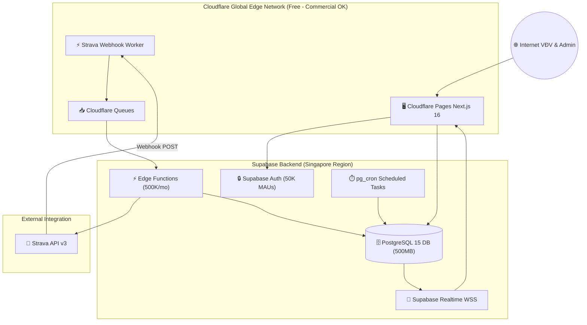

# 🌐 Allocation & Deployment Architecture View — Strava Ranking

> **Tài liệu Hạ Tầng Phân Bổ Triển Khai**: Chi tiết hạ tầng Serverless Cloudflare Pages + Workers & Supabase ($0/tháng cho 500 VĐV commercial).

---

## 1. Môi Trường Triển Khai (Cloudflare & Supabase Free Infrastructure)

- **Frontend & Edge SSR**: Cloudflare Pages chạy Next.js 16 Edge Runtime (băng thông không giới hạn).
- **Webhook Worker**: Cloudflare Worker tiếp nhận Webhook từ Strava API v3, phản hồi `200 OK` tức thì (<50ms).
- **Queue System**: Cloudflare Queues xử lý không đồng bộ các sự kiện bài tập mới mà không lo rate limit.
- **Database Server**: Supabase PostgreSQL 15 (500MB DB storage, RLS Policies, Materialized Views).
- **Scheduled Jobs**: `pg_cron` tích hợp sẵn trong PostgreSQL để refresh materialized view mỗi 60 giây và tự động làm mới Strava access tokens.

### Deployment Diagram Tổng Quan

---

## 2. Bảng Ngân Sách Chi Phí Hạ Tầng (Free Tier Budget - Commercial Allowed)

| Hạng mục hạ tầng | Dịch vụ cung cấp | Giới hạn Free Tier | Dự kiến sử dụng | Chi phí thực tế |
|:---|:---|:---|:---|:---|
| **Frontend & SSR** | Cloudflare Pages | **Không giới hạn băng thông** | ~5 GB/tháng | **$0.00** |
| **Edge Requests** | Cloudflare Workers | 100,000 req/ngày | ~3,000 req/ngày | **$0.00** |
| **Webhook Queues** | Cloudflare Queues | 10,000 ops/ngày | ~500 ops/ngày | **$0.00** |
| **PostgreSQL Database** | Supabase DB | 500 MB storage | ~15 MB storage | **$0.00** |
| **Authentication** | Supabase Auth | 50,000 MAUs | 500 VĐV | **$0.00** |
| **Edge Functions** | Supabase Edge Fn | 500,000 invocations/tháng | ~15,000/tháng | **$0.00** |
| **TỔNG CHI PHÍ** | | | | **$0.00 / tháng** 🎉 |

---

## 3. Architecture Decision Records (ADR)

### ADR-001: Chọn Cloudflare Pages + Supabase thay vì Vercel
- **Trạng thái:** Được chấp thuận.
- **Ngữ cảnh:** Vercel cấm thương mại ở gói Hobby. Dự án công ty yêu cầu giải pháp $0/tháng thương mại hợp lệ.
- **Quyết định:** Sử dụng Cloudflare Pages (Free Commercial OK) kết hợp Supabase PostgreSQL Free Tier.
- **Hệ quả:** Tiết kiệm 100% chi phí vận hành cho công ty mà vẫn đảm bảo tốc độ tải trang 0ms.

### ADR-002: Chọn Soft Delete (`is_deleted = true`) Bảo Vệ Dữ Liệu
- **Trạng thái:** Được chấp thuận.
- **Ngữ cảnh:** Tránh việc tài khoản Admin bị can thiệp hoặc nhấp nhầm làm mất hoàn toàn dữ liệu cuộc thi và bài tập của VĐV.
- **Quyết định:** Áp dụng cờ `is_deleted = true` và `deleted_at = TIMESTAMP`.
- **Hệ quả:** Bảo vệ an toàn tuyệt đối 100% dữ liệu gốc trong PostgreSQL.

### ADR-003: Khóa Tự Động Thể Lệ Cuộc Thi (`Immutability Lock`)
- **Trạng thái:** Được chấp thuận.
- **Ngữ cảnh:** Tránh việc Admin sửa đổi dải pace hoặc tỉ lệ quy đổi giữa chừng làm thay đổi thứ hạng đã diễn ra.
- **Quyết định:** Vô hiệu hóa toàn bộ ô sửa quy tắc khi cuộc thi `active` hoặc `ended`.
- **Hệ quả:** Đảm bảo tính công bằng và minh bạch tối đa cho giải đấu.
