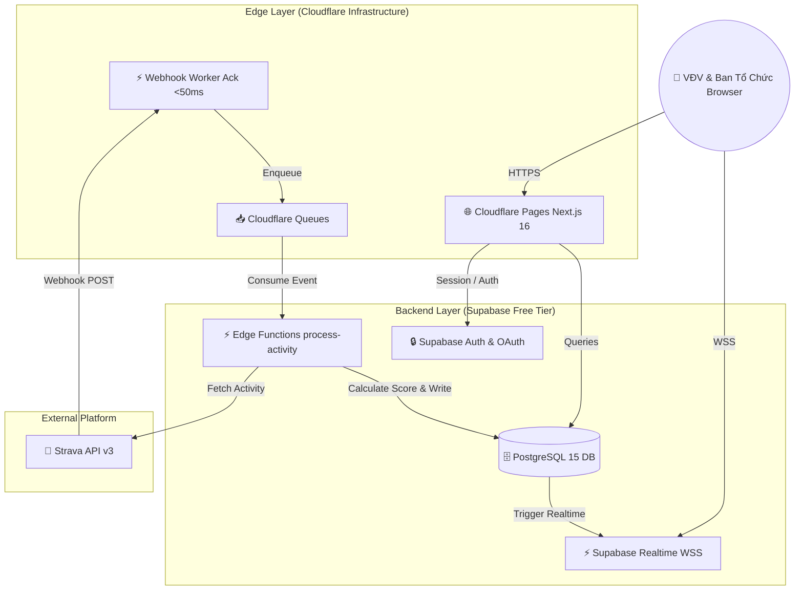
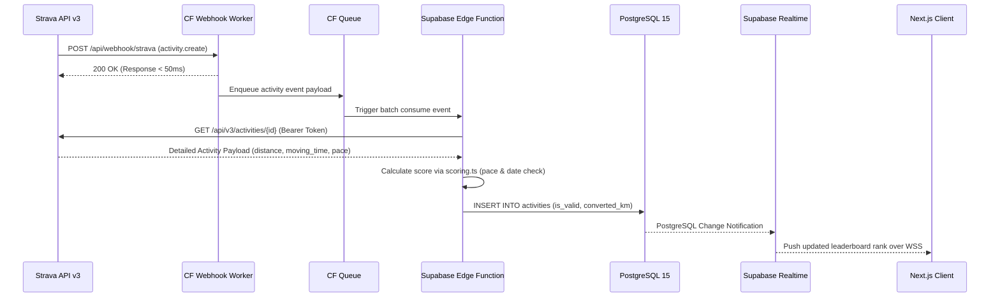
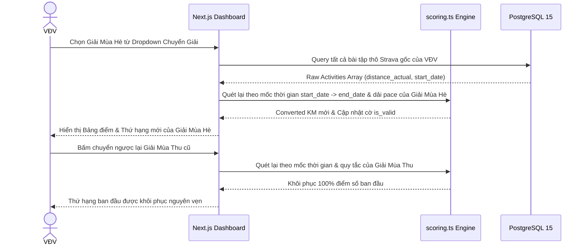

# 🏗️ Component & Connector View (C&C View) — Strava Ranking

> **Tài liệu Mô Tả Thành Phần & Kết Nối Runtime**: Cấu trúc các thành phần thực thi và luồng dữ liệu thời gian thực (Realtime & Webhooks).

---

## 1. Runtime Components & Connectors

### Các Thành Phần Thực Thi (Components):
1. **Next.js 16 Web App (Cloudflare Pages)**: Trình duyệt web (Client-side) và Edge Server cho Server-Side Rendering (0ms cold start).
2. **Cloudflare Webhook Worker**: API Worker tiếp nhận Webhook từ Strava API v3, phản hồi `200 OK` tức thì (<50ms).
3. **Cloudflare Queues**: Xử lý hàng đợi sự kiện bài tập không đồng bộ.
4. **Supabase PostgreSQL 15**: Cơ sở dữ liệu quan hệ, lưu thông tin VĐV, phòng ban, giải đấu và bài tập.
5. **Supabase Edge Functions**: Thực thi Động cơ quy đổi điểm (`scoring.ts`), đối soát dải pace/speed và làm mới Strava OAuth token batch.
6. **Supabase Realtime (WebSockets)**: Đẩy trực tiếp thông báo điểm số mới lên Bảng Xếp Hạng của Client.
7. **Strava API v3**: Dịch vụ Strava quản lý bài tập và kết nối VĐV.

### Các Chuẩn Kết Nối (Connectors):
- **HTTPS / REST API**: Chuẩn giao tiếp giữa Client và Cloudflare Pages, giữa CF Worker và Strava API.
- **WebSocket (WSS)**: Đẩy dữ liệu Bảng xếp hạng real-time từ Supabase sang Next.js App.
- **Database Connection (TCP)**: Giao tiếp bảo mật từ Edge Functions tới PostgreSQL.

---

## 2. Sơ Đồ Thành Phần Hệ Thống (System Runtime Overview)

---

## 3. Sequence Diagrams (Các Luồng Xử Lý Chính)

### 3.1. Luồng Tiếp Nhận & Quy Đổi Điểm Webhook Async

### 3.2. Luồng Chuyển Ngữ Cảnh Cuộc Thi & Khôi Phục Điểm 2 Chiều

