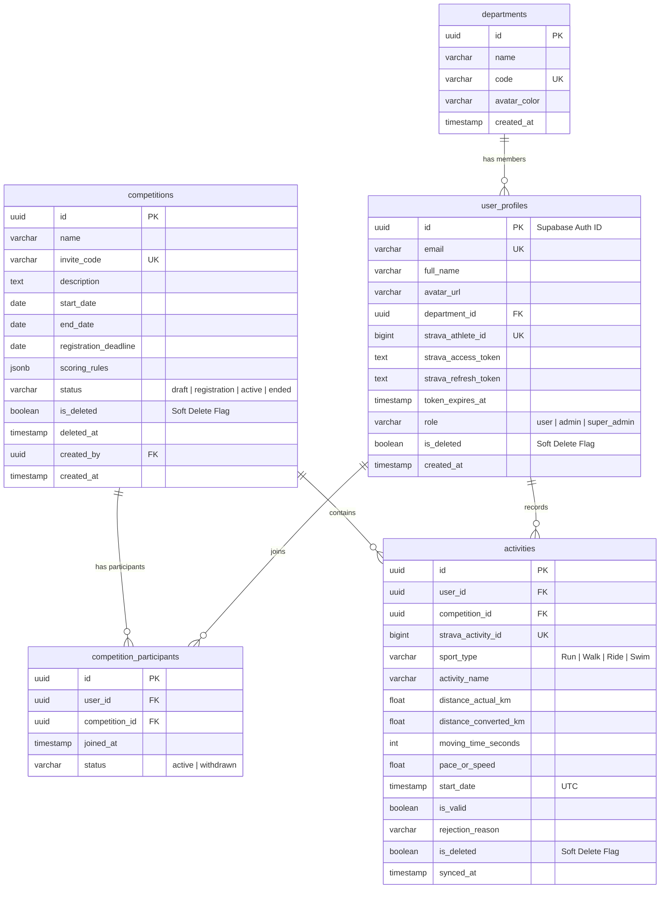

# 🗄️ Database Entity Relationship Diagram (ERD) & Schema — Strava Ranking

> **Database Engine:** PostgreSQL 15 (Supabase Managed Database)  
> **Kiến trúc Bảo mật:** Row Level Security (RLS) & Soft Delete

---

## 📐 1. Sơ Đồ Thực Thể Quan Hệ (ERD Diagram)



---

## 📜 2. Full SQL Schema Migration Script

```sql
-- 1. Table Competitions (với Soft Delete & Rules Lock)
CREATE TABLE competitions (
    id UUID PRIMARY KEY DEFAULT gen_random_uuid(),
    name VARCHAR(255) NOT NULL,
    invite_code VARCHAR(50) UNIQUE NOT NULL,
    description TEXT,
    start_date DATE NOT NULL,
    end_date DATE NOT NULL,
    registration_deadline DATE NOT NULL,
    scoring_rules JSONB NOT NULL DEFAULT '{}'::jsonb,
    status VARCHAR(20) NOT NULL DEFAULT 'draft',
    is_deleted BOOLEAN NOT NULL DEFAULT false,
    deleted_at TIMESTAMPTZ,
    created_by UUID REFERENCES auth.users(id),
    created_at TIMESTAMPTZ DEFAULT NOW()
);

-- 2. Table Departments
CREATE TABLE departments (
    id UUID PRIMARY KEY DEFAULT gen_random_uuid(),
    name VARCHAR(100) NOT NULL,
    code VARCHAR(20) UNIQUE NOT NULL,
    avatar_color VARCHAR(20) DEFAULT '#2563EB',
    created_at TIMESTAMPTZ DEFAULT NOW()
);

-- 3. Table User Profiles
CREATE TABLE user_profiles (
    id UUID PRIMARY KEY REFERENCES auth.users(id) ON DELETE CASCADE,
    email VARCHAR(255) UNIQUE NOT NULL,
    full_name VARCHAR(255) NOT NULL,
    avatar_url TEXT,
    department_id UUID REFERENCES departments(id),
    strava_athlete_id BIGINT UNIQUE,
    strava_access_token TEXT,
    strava_refresh_token TEXT,
    token_expires_at TIMESTAMPTZ,
    role VARCHAR(20) NOT NULL DEFAULT 'user',
    is_deleted BOOLEAN NOT NULL DEFAULT false,
    created_at TIMESTAMPTZ DEFAULT NOW()
);

-- 4. Table Competition Participants
CREATE TABLE competition_participants (
    id UUID PRIMARY KEY DEFAULT gen_random_uuid(),
    user_id UUID NOT NULL REFERENCES user_profiles(id) ON DELETE CASCADE,
    competition_id UUID NOT NULL REFERENCES competitions(id) ON DELETE CASCADE,
    joined_at TIMESTAMPTZ DEFAULT NOW(),
    status VARCHAR(20) NOT NULL DEFAULT 'active' -- active | withdrawn
);

-- 5. Table Activities
CREATE TABLE activities (
    id UUID PRIMARY KEY DEFAULT gen_random_uuid(),
    user_id UUID NOT NULL REFERENCES user_profiles(id) ON DELETE CASCADE,
    competition_id UUID REFERENCES competitions(id),
    strava_activity_id BIGINT UNIQUE NOT NULL,
    sport_type VARCHAR(20) NOT NULL,
    activity_name VARCHAR(255) NOT NULL,
    distance_actual_km NUMERIC(10, 2) NOT NULL,
    distance_converted_km NUMERIC(10, 2) NOT NULL,
    moving_time_seconds INT NOT NULL,
    pace_or_speed NUMERIC(10, 2) NOT NULL,
    start_date TIMESTAMPTZ NOT NULL,
    is_valid BOOLEAN NOT NULL DEFAULT true,
    rejection_reason TEXT,
    is_deleted BOOLEAN NOT NULL DEFAULT false,
    synced_at TIMESTAMPTZ DEFAULT NOW()
);

-- Indexes tối ưu hiệu năng Bảng xếp hạng dưới 5ms
CREATE INDEX idx_activities_comp_valid ON activities (competition_id, is_valid, is_deleted);
CREATE INDEX idx_users_dept ON user_profiles (department_id);
```

---

## 🔒 3. Row Level Security (RLS Policies)

```sql
ALTER TABLE user_profiles ENABLE ROW LEVEL SECURITY;
ALTER TABLE activities ENABLE ROW LEVEL SECURITY;
ALTER TABLE competitions ENABLE ROW LEVEL SECURITY;

-- 1. Read Policy: Công khai dữ liệu thi đấu (Leaderboard)
CREATE POLICY "Public Read Leaderboard" ON activities
    FOR SELECT USING (is_deleted = false);

-- 2. Update Policy: User chỉ được cập nhật profile của chính mình
CREATE POLICY "Own Profile Update" ON user_profiles
    FOR UPDATE USING (auth.uid() = id);

-- 3. Admin Full Policy: Admin quản trị có toàn quyền
CREATE POLICY "Admin Management" ON competitions
    FOR ALL USING (
        EXISTS (
            SELECT 1 FROM user_profiles
            WHERE user_profiles.id = auth.uid()
            AND user_profiles.role IN ('admin', 'super_admin')
        )
    );
```
