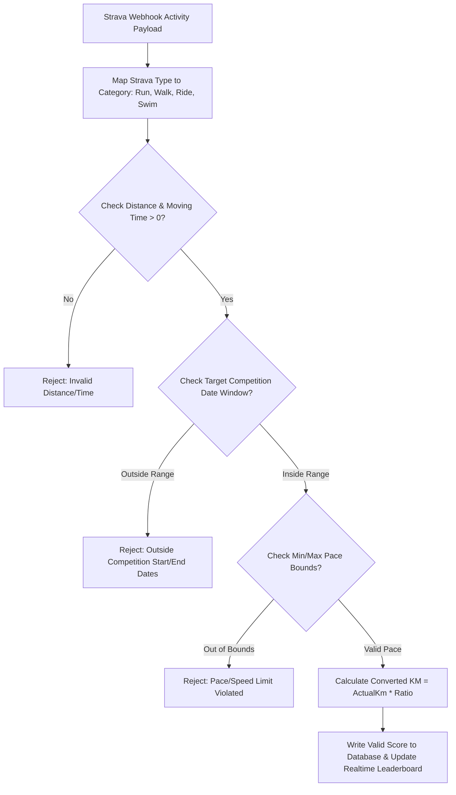

# 🧱 System Architecture & Module View — Strava Ranking

> **Tài liệu Kiến Trúc Phân Lớp & Sitemap 19 Routes**: Chi tiết giao diện Next.js 16, các Module tính điểm, và phân quyền truy cập.

---

## 🗺️ 1. Bản Đồ Phân Quyền 19 Routes (Sitemap & Access Matrix)

```
app/
├── (public)/                 # Public Guest Routes (Khách vãng lai)
│   ├── page.tsx              # / -> SaaS Landing Page
│   ├── join/[code]/page.tsx  # /join/:code -> Invite link landing page
│   └── rules/page.tsx        # /rules -> Public rules preview
│
├── (auth)/                   # Protected Participant Routes (VĐV qua Strava)
│   ├── layout.tsx            # Authenticated layout & Mobile Bottom Nav
│   ├── dashboard/page.tsx    # /dashboard -> Personal stats & active competition rescoring
│   ├── leaderboard/page.tsx  # /leaderboard -> Gamified Podium Top 3 & progress bar
│   └── profile/page.tsx      # /profile -> User info & Strava OAuth status
│
├── (admin)/                  # Protected Admin Routes (Ban tổ chức)
│   ├── layout.tsx            # Admin Sidebar Layout
│   └── admin/
│       ├── page.tsx          # /admin -> Overview stats & copy invite code
│       ├── login/page.tsx    # /admin/login -> Admin Email/Pass Login
│       ├── competitions/     # /admin/competitions
│       │   ├── page.tsx      # List competitions with Soft Delete (is_deleted)
│       │   ├── new/page.tsx  # /admin/competitions/new -> Competition builder
│       │   └── [id]/page.tsx # /admin/competitions/:id -> Rules Immutability Lock
│       ├── departments/      # /admin/departments -> Department CRUD
│       ├── users/            # /admin/users -> Strava Athlete ID check & Remove/Restore
│       ├── activities/       # /admin/activities -> Moderation & Manual Strava ID resync
│       └── reports/          # /admin/reports -> UTF-8 BOM CSV Excel Export
│
└── api/                      # API Endpoints
    ├── auth/strava/          # Strava OAuth Initiate & Callback
    └── webhook/strava/       # Strava API v3 Event Webhook Receiver
```

---

## 🧮 2. Động Cơ Quy Đổi Điểm Động (`src/lib/strava/scoring.ts`)

### Luồng xử lý quy đổi (Scoring Engine Pipeline):



### Quy tắc tính toán:
- **Pace Chạy/Đi bộ**: `(MovingTimeSeconds / 60.0) / DistanceKm` (`min/km`).
- **Tốc độ Đạp xe**: `DistanceKm / (MovingTimeSeconds / 3600.0)` (`km/h`).
- **Pace Bơi lội**: `(MovingTimeSeconds / 60.0) / (DistanceKm * 10)` (`min/100m`).
